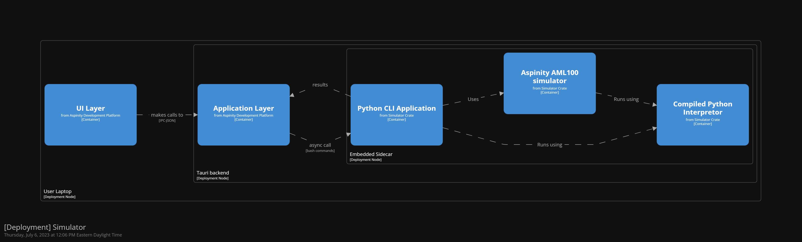

# 4. Use Tauri sidecar to invoke python simulator

Date: 2023-07-06

## Status

Accepted

## Context

The goal is to simulate a network by using Aspinity's simulator for the AML100 chip. We will call this AML100 Simulator from now to avoid confusion.

Our initial understanding was that the we will interface with the AML100 Simulator natively in Rust.
On June 22, 2023 we recieved an email from Glen which confirmed that this would not be possible, and that we need to interface with the simulator using Python.

Upon analysis, we identified 4 potential solutions. These solutions along with their tradeoffs are listed below:

- **Use PyO3 to make python calls from rust.**
  - Enables us to call the AML100 Simulator directly from rust.
  - Does not natively support passing Python objects as parameters since each parameter must be serializable. AML100 Simulator uses python Network object to simulate the network.
  - Limited documentation
  - Requires user to have python installed on their computer (dynamic linking).
  > *Verdict: Rejected - Requires changes to AML100 Simulator.*
- **Using Pyscript to make python calls from browser side javascript.**
  - Enables us to call AML100 directly from javascript on the UI.
  - Will lead to very tight coupling with simulator on the client side making it hard to port the application to the cloud.
  - Pyscript is not production ready.
  - Unable to import whl directly in the browser and might require transferring large packages over the network when we move to the cloud.
  > *Verdict: Rejected - Does not satisfy portability QA.*
- **Pivot to using Electron to package the application.**
  - Enables us to use a Django backend running via Node.js. This will enable us to call the AML100 Simulator directly.
  - Requires rework including some experiements to identify feasibility. Will set us back considerably.
  - Requires user to have python installed indepently on their computer.
  - Will result in multiple technology stacks needed to maintain the entire application. (including AML100 Simulator and Analog ML Connect)
  - Check experiment for details [here](https://aspinity-mse-2023.atlassian.net/browse/A2M-494)
  > *Verdict: Rejected - Requires substantial rework.*
- **Embed a python sidecar containing the AML100 Simulator into Tauri.**
  - Enables us to embed a python runtime containing AML100 Simulator as a sidecar into the application by invoking the command in an asynchronous subprocess.
  - Porting to the cloud will not require extra changes. (unless we decouple the simulator into a seperate service. In this case, the added effort will be minimal).
  - Extra effort required to create a command line interface to the AML100 Simulator in Python.
  - Check experiment for details [here](https://aspinity-mse-2023.atlassian.net/browse/A2M-186)
  > *Verdict: Proposed - Meets all requirements with added effort to create CLI app.*

## Decision

Embed a Tauri sidecar into the application. This sidecar contains a compiled python interpretor, and a CLI python application wrapping the AML100 Simulator.
This CLI python app must be turned into an executable using PyInstaller and then embedded into the Tauri app.

## Consequences

### Benefits

- Meets all requirements
- Reduces the number of inter-process calls for charting libraries.
- Does not require the user to have python installed on their laptop

### Drawbacks

- Requires additional effort to create python CLI app
- Introduces an additional interface layer between AML100 and Analog ML connect.