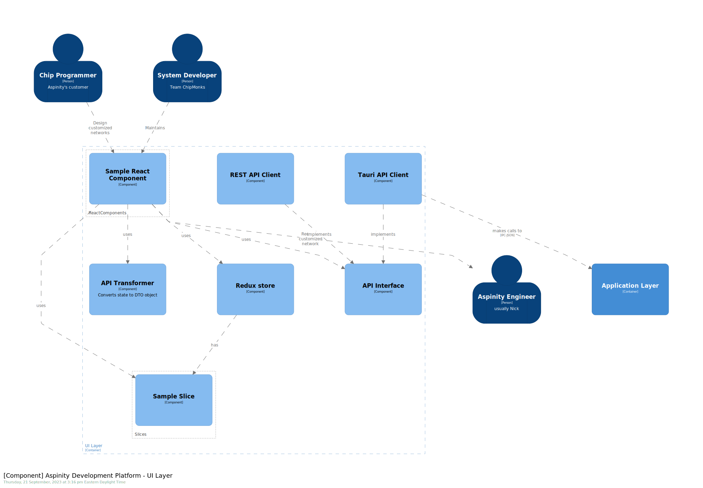
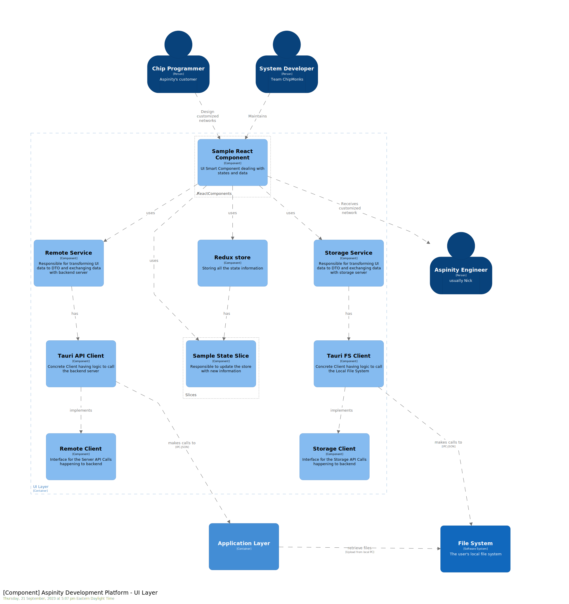
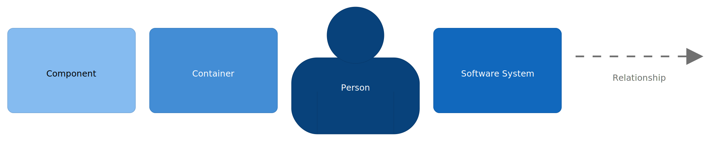

# 6. Frontend - Backend Interaction

Date: 2023-09-21

## Status

Accepted

## Context

This record talks about the modification needed in the front-end architecture with respect to how UI components interact with backend components (like Server or Storage Systems). 

The current front-end architecture (as shown below) talks about using a **Single API Transformer**, that would receive the data (UI Specific) from React Components and then convert into required Data Transfer Object (DTO) and then return that data to the component. Then component would call **API Interface** with the requested DTO, get the response and then again call **API Transformer** to convert the response DTO in UI specific data.

Following are the motivations behind the change in this architecture:
 - We don't want React components to deal with DTO, because change in DTO might cause change in the React components.
 - We observed that DTO conversions, API calls and then converting DTO back to UI data is pretty standard sequence in every component, and thus want to abstract it out.
 - We want to keep the architecture portable, that can support future web prospect without any major changes in the React components.

<!-- 
 -->

## Decision

As a result of above motivations, here is the proposal of new architecture with respect to how UI would interact with backend:

<!-- 

 -->

Here is the flow of this architecture:
 - React Component would call the required service (Remote or Storage) with the given UI specific data.
 - The service would be responsible for transforming the data into respective DTOs and then call the required client to further process the information.
 - It will take the response from client and then convert it back to UI specific objects and give it to the required components.

Moreover,
 - The clients used by the services would implement the decided interfaces between front-end and backend

## Consequences

Following are the advantages of using this approach:
 - React Components would not have to worry about any Front-end backend contracts (DTOs), as that would be dealt by the service in between.
 - It enables portability, because change in the backend system (like going to HTTP based protocols from IPC protocols) would not introduce change to either the React components, or the Service, as long as the client implements its required interface.
 - It enables modifiablity, because change in the DTO contracts would involve change in services only, thereby insulating clients and components from that change.
 - The transformation logic would be distributed across various services, as opposed to a single API transformer.
 - Change in React components won't hinder any logic as to how front-end interacts with backend system.

Following are some downsides of this approach:
 - Increases number of modules to maintain.
 - Increases the complexity of flow.
